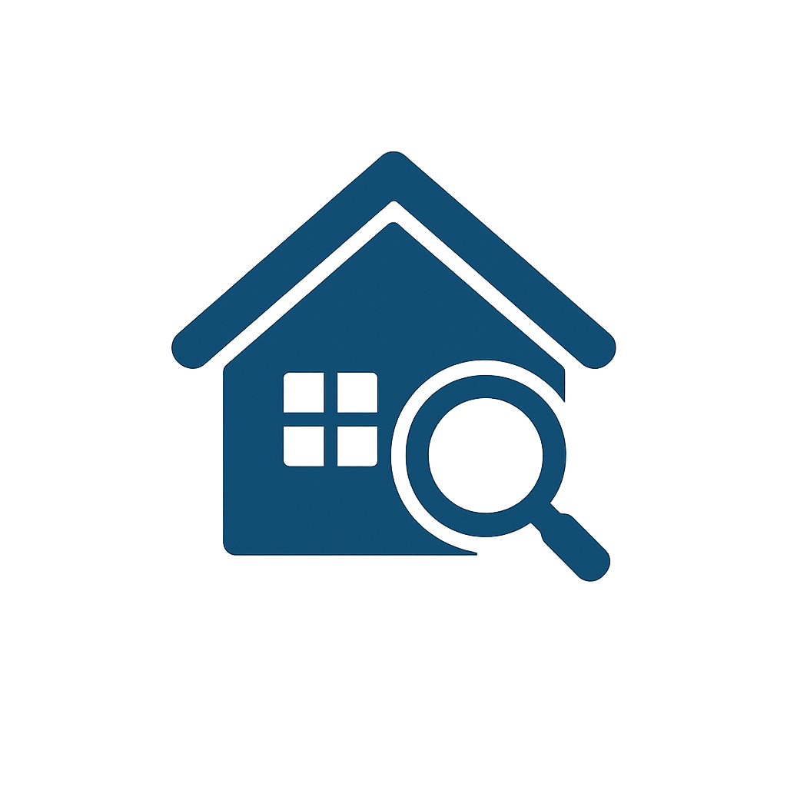
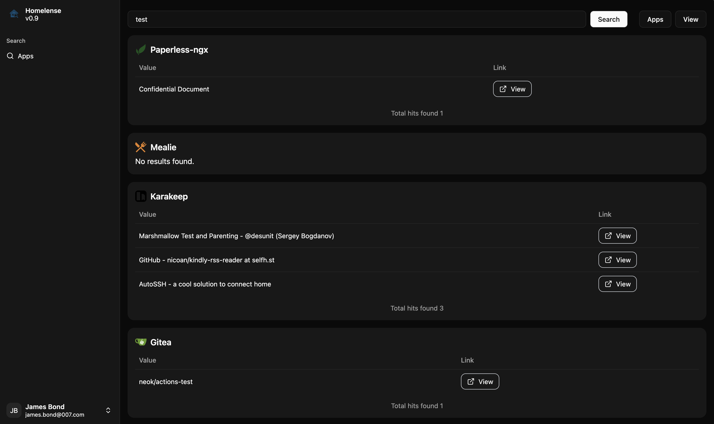

# 

# 🏠🔍 Homelense

**Homelense** is a self-hosted **metasearch engine** designed for your homelab. It lets you search across all your self-hosted applications from a single interface — using their APIs.



## 🚀 Features

- 🔍 **Unified Search** – Quickly find content stored in any of your self-hosted apps by keywords.
- 🌐 **Custom Sources** – Point HomeLense at your own APIs.
- 🧩 **Plugin System** – Extend discovery and searches with custom plugins.
- 🎨 **Clean UI** – Minimalistic and responsive dashboard for desktop and mobile.
- ⚙️ **Single .env-based Config** — All settings are centralized and configurable via one single `.env` file.
- 🔐 **OAuth Support** — (Optional) Easily secure access with OAuth2 (supports common providers).
- ⚡ **Fast & Lightweight** — Minimal resource usage, optimized for self-hosting.


## 🛠️ Installation

### 🐳 Docker

```bash
services:
  homelense:
    image: ghcr.io/neok0/homelense:latest
    container_name: homelense
    env_file:
      - ./app/.env
    ports:
      - 3000:3000
```

### 🔧 Development

```bash
git clone https://github.com/neok0/homelense.git
cd homelense
cp env.sample app/.env
cd app
bun run dev
```
I'm using bun, you probably can run it via different means as well. Now, point your browser to `localhost:3000`.


## 📂 Configuration

The entire app can be configured by using one simple `.env` file.
See following sections for customization of different parts of the app.

## 🧩 Plugins

You can easily enable search plugins via three .env variables:

```bash
NUXT_PUBLIC_SEARCH_PLUGIN_KARAKEEP_ENABLED=true
NUXT_SEARCH_KARAKEEP_API_URL=https://hoarder.example.de
NUXT_SEARCH_KARAKEEP_API_TOKEN=<secret token>
```

Currently supported search plugins:
- Gitea
- Paperless-NGX
- Jellyfin
- Karakeep
- Mealie
- Custom

More plugins will be added in future versions.

## Development
You can create a new plugin in four simple steps:
1. Add required env variables to `nuxt.config.ts`.
2. Copy exsting plugin from `app/server/` folder and adjust endpoit logic accordingly.
3. Add the required icon for this search plugin to `app/public/images/icons/`
3. Add new search to plugin list in `app/components/search/Search.vue`

## 🔐 OAuth Setup

Per default there is no authentication enabled, which can be added via addition tools like [oauth2-proxy](https://github.com/oauth2-proxy/oauth2-proxy).
However, HomeLense also supports OAuth2 login with these providers currently directly from within the app:
- Authentik
- Github

You can enable OAuth2 authentication via:

```bash
NUXT_PUBLIC_USE_OAUTH=true
NUXT_SESSION_PASSWORD=<random-32chars>
```

and the dedicated provider variables:

```bash
NUXT_PUBLIC_USE_OAUTH_PROVIDER_NAME=<provider>
NUXT_OAUTH_<PROVIDER>_CLIENT_ID
NUXT_OAUTH_<PROVIDER>_CLIENT_SECRET
```
More providers can be easily added in future releases.

### Authentik
To use Authentik set the following in .env in addition:

```bash
NUXT_PUBLIC_USE_OAUTH_PROVIDER_NAME=authentik # lowercase
NUXT_OAUTH_AUTHENTIK_DOMAIN=<authentik.example.com>
NUXT_OAUTH_AUTHENTIK_CLIENT_ID=<homelense>
NUXT_OAUTH_AUTHENTIK_CLIENT_SECRET=<secret>
```

### Github
To use Github set the following in .env in addition:
```bash
NUXT_PUBLIC_USE_OAUTH_PROVIDER_NAME=github # lowercase
NUXT_OAUTH_PROVIDER_NAME=<github>
NUXT_OAUTH_GITHUB_CLIENT_ID=<github_client>
NUXT_OAUTH_GITHUB_CLIENT_SECRET=<github_secret>
```

## Additional Usage

### URL-Based Search

You can trigger searches directly from your browser's address bar using query parameters.

#### Basic Search

To perform a search across all configured endpoints, use the following URL format:

`https://homelense.example.com/search?q=test`

This will trigger a search for test.

#### Search Specific Endpoints

To search only a specific endpoint, add the m parameter:

`https://homelense.example.com/search?q=test&m=karakeep`

#### Search Multiple Endpoints

You can target multiple endpoints by including additional m parameters:

`https://homelense.example.com/search?q=test&m=karakeep&m=mealie`


## 🛡️ Security

HomeLense is designed to run locally on your home network. For exposed instances, reverse proxy with authentication (e.g., Authelia, OAuth2-Proxy) is **highly recommended**.

## 🧱 Tech Stack

- Vue Nuxt
- Docker

## 📦 Roadmap

- [ ] Fine-tuned Access Control per search
- [ ] Support for more selfhosted applications
- [ ] Multiple custom search endpoints

## 🤝 Contributing

Contributions welcome! Just fork, create a branch, and PR with your change. For major changes, open an issue first.

## 📄 License

MIT License
